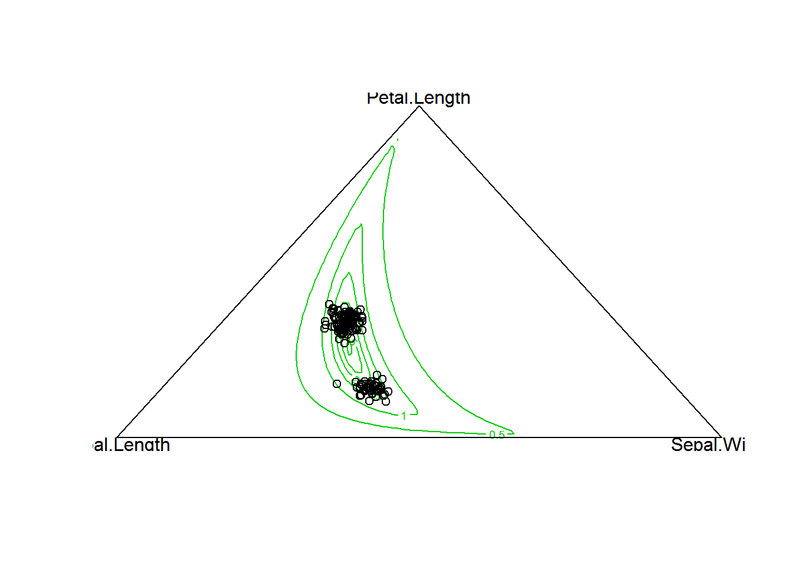
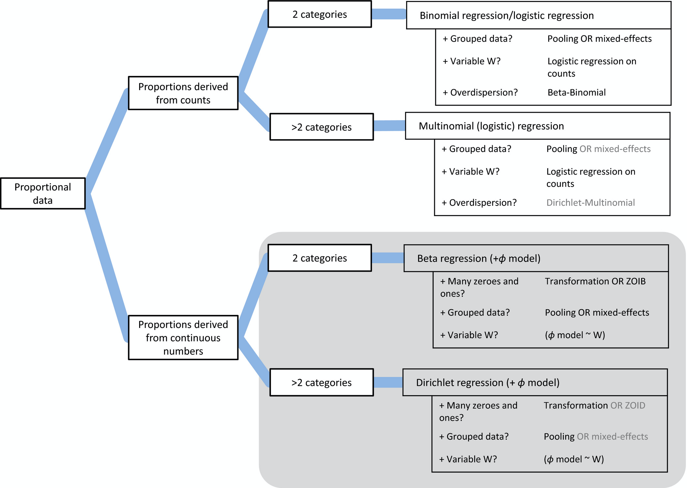

```{r setup, include=FALSE}
knitr::opts_chunk$set(echo = TRUE)
```

# Definition 
<li>Multivariate generalization fo the beta distribution, also called a multivariate beta distribution. </li>
<li>Conjugate prior in Bayes for the categorical distribution and the multinomial distribution. </li>
<li> Often denoted as Dir($\alpha$) </li>
<li> Vectors of  or more elements of continuous random variables. Can take values from 0 to 1 and those that sum to 1.</li>

## Parameters 
<li> K is number of categories, must be 2 or more </li> 
<li> $\alpha$ is a vector of parameters for multivariate probability distributions </li> 

# Plot 
This is difficult to do in R, so here is a pasted image of what you can expect from a Dirichlet distribution. 
```{r}

```

# Mathematical Definition
$$ f(X_i....,x_K; \alpha_1,..., \alpha_K) = \frac{1}{B(\alpha)}\displaystyle\prod^{k}_{i=1} x_i^{\alpha_i -1}$$ 

This can be simplified to: 
$$\displaystyle\sum_{i=1}^{K} X_i = 1 $$
Where $x_i$ is from 0 to 1 for all samples of $K$. 

The normalizing constant, B, is the multivariate beta function and denoted as: 
$$ B(\alpha) = \frac{\displaystyle\prod_{i=1}^{K} \Gamma(\alpha_i)}{\displaystyle\Gamma (\sum_{i=1}^K \alpha_i)}$$

# Moments
The moments can be expressed as a singular matrix with the following formula: 
$$E[\displaystyle\prod^{k}_{i=1} X_i^{\beta_i}] = \frac{B(\alpha +\beta)}{B(\alpha)}$$
Which is then extended to : 

$$= \frac{\Gamma(\sum\limits_{i=1}^{k}\alpha_i)}{\Gamma[\displaystyle\sum_{i=1}^{K}(\alpha_i +\beta_i)]}  X \displaystyle\prod^{K}_{i=1} \frac{\Gamma (\alpha_i +\beta_i)}{\Gamma(\alpha_i)}$$

# Use in Ecology 
<li> Can be useful for expressing proportion data that is continuous (not count based) proportion data. Example of this could be fraction time spend on an activity budget, especially when over 2 categories of proportions being analyzed. </li> 
<li> this diagram from Douma and Weedon is helpful:</li> 
```{r}

```
<li> Help model relative shifts in abundance between treatment groups and a control.</li> 
<li> Useful for explain characteristics of microbiomes and microbiology. </li> 


# References 

**Douma, J.C. and Weedon, J.T.** 2019. Analysizng continuous proportions in ecology and evolution: A practical introduction to beta Dirichlet regression. *Methods in Ecology and Evolution* 10:1412-1430. DOI: https://doi.org/10.1111/2041-210X.13234.
**Harrison, J.G., Calder, W.J., Shastry, V., and Buerkle, C.A.** 2019.Dirichlet-multinomial modelling outperforms alternatives for analysis of microbiome and other ecological count data. *Molecular Ecology Resources* 20: 481-497. DOI: https://doi.org/10.1111/1755-0998.13128. 

 