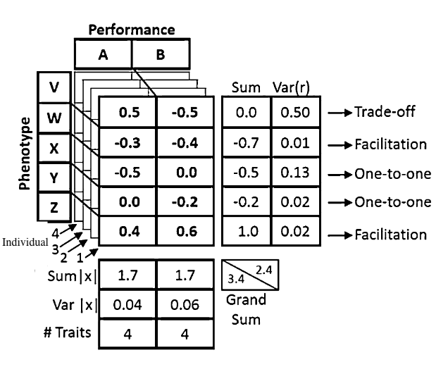

```{r setup, include=FALSE}
knitr::opts_chunk$set(echo = TRUE)
```
# Introduction
For my project, I propose methods to understand the social dominance of hummingbirds and how social hierarchies are maintained. To evaluate this, I will use both field and lab work to create a model that reflects the phenotype > performance > fitness paradigm presented by Arnold in 1983 (Arnold, 1983). The actual variables I will measure are outlined below in the [Measurement Variables] section. Overall, I will set these experiments up with dyadic combinations of trials between two male hummingbirds where a limiting resource is introduced (nectar or perches) to establish which individual maintains access to this resource and chases away an opponent. I will then connect these wins to traits about the individual that are variable. These will be phenotypic morphometric traits, as well as performance measurements from metabolic and flight kinematic measures. Lastly, with these characteristics I hope to understand how phenotypes and fitness connect to performance in an ecological landscape. I hope to do this by combining 1. fight data from the field and those winning individuals' phenotypes and 2.  more fine-tuned phenotypic data and one-on-one fight results from lab trials. With this, I seek to establish what phenotypes and fitness performance traits are most predictable of social dominance hierarchies in hummingbirds. 

# Questions 
Based on the above introduction, I ask the following two questions: \

**1.** What variables in a complex suite of hummingbird morphological traits and flight maneuvers predict the winner of fights, and how do these variables co-vary with energetic cost?\

**2.** How do the selective pressures to obtain mates and resources in natural ecosystems translate to free-living dominance hierarchies?\
 
# Method 
To investigate this, I hope to use the Arnold's Paradigm proposed in his 1983 paper. The framework below (Bergmann and McElroy, 2014) illustrates this experiment method graphically (below.)

```{r}

```
(Bergmann and McElroy, 2014)

# Measurement Variables
I will be using a modified version of this Arnold framework in [Method] , but instead of comparing the phenotype-performance relationship of each species, I will be evaluating this on an individual level. My measurements, and their categories, will be: \

**Phenotypic Measures:** \
<li>Wing Aspect Ratio</li>\
<li>Body Mass</li>\
<li>Body Composition (fat and muscle)</li>\

**Performance Measures:**
<li>Daily Energy Expenditure</li>\
<li>Latent Burst Metabolism</li>\
<li>Energetic Power Efficiency</li>\
<li>Flight Rotational Velocities</li>\

# Data and Model
I will be holding 6 Calliope Hummingbirds (*Selasphorus calliope*) captive in the spring of 2023. As I do not yet have data, I will find public repositories of data similar to that which I will collect. The data I am looking for will likely come from multiple sources and will be of two forms:\
**1.** One-on-one dyadic fight results, which I can integrate into a Bayes framework to use as priors to predict winners of unique dyads. I would then like to integrate morphometrics to these predictors to see if they co-vary. Data from Márquez-Luna et al. 2022. provides dyadic win-loss data, but only as sums and it is interspecific, so I am hopeful to find another source with intraspecific competitions results.\
**2.** I can use prior data collected by the Tobalske lab, potentially supplemented with other published data on Calliope hummingbirds to provide morphometric data. I can then hopefully find open source data on the fitness (metabolic rate and body composition) measures so that I can model the regressions between each phenotype and fitness combination in the matrix. If I have difficulty finding this data for Calliope hummingbirds, I will likely find it for *Calypte anna* instead, as it is more greatly studied, metabolic measures have already been published,and I have collaborators studying this species. 

# References 
**Arnold. 1983.** Morphology, Performance and Fitness. American Zoology 23:347-361. 

**Bergmann and McElroy.** 2014. Many-to-Many Mapping of Phenotype to Performance: An Extension of the F-Matrix for Studying Functional Complexity. Evolutionary Biology 41:546–560. DOI 10.1007/s11692-014-9288-1

**Márquez-Luna et al. 2022.** Genetic relatedness and morphology as drivers of interspecific dominance hierarchy in hummingbirds. PeerJ. DOI 10.7717/peerj.13331